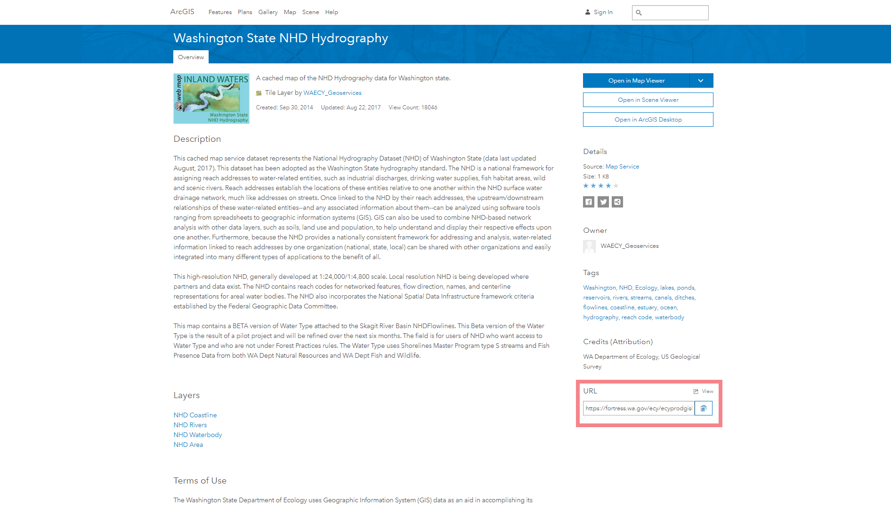

# esri2sf
Scraping Geographic Features from ArcGIS Server

Still many geographic data is delivered through ESRI's ArcGIS Server. 
It is not easy to utilize the geographic data in the GIS servers from data analysis platform like R or Pandas. 
This package enables users to scrape vector data in ArcGIS Server from R through the server's REST API. 
It download geographic features from ArcGIS Server and saves it as [Simple Features](https://cran.r-project.org/web/packages/sf/vignettes/sf1.html). 


## How it works

This program sends a request to an ArcGIS Server and gets json responses containing coordinates of geometries 
of which format is not the same as geojson. So it converts the json into simple feature geometries from the response. 
Then it combines attribute data to the geometries to create sf dataframe. 
Often ArcGIS servers limits the maximum number of rows in the result set. So this program 
creates 500 features per request and automatically re-send requests until it gets all features in the dataset. 

## Install

Use [remotes](https://cran.r-project.org/web/packages/remotes/index.html) to install this package. This package has dependency on dplyr, sf, httr, jsonlite.

```R
library(remotes)
install_github("yonghah/esri2sf")
```

## How to use

What you need is the URL of REST service you want. You can get the URL by viewing the URL widget on the service's webpage (see image below), 
by asking a GIS admin, or looking at the javascript code of a webpage where it creates a feature layer.



### Point data

```{R points}
library("esri2sf")
url <- "https://services.arcgis.com/V6ZHFr6zdgNZuVG0/arcgis/rest/services/Landscape_Trees/FeatureServer/0"
df <- esri2sf(url)
plot(df)
```
<!--  -->


### Polyline data

You can filter output fields. This may take a minute since it gets 18000 polylines. 

```{R polyline}
url <- "https://services.arcgis.com/V6ZHFr6zdgNZuVG0/arcgis/rest/services/Florida_Annual_Average_Daily_Traffic/FeatureServer/0"
df <- esri2sf(url, outFields=c("AADT", "DFLG"))
plot(df)
```
<!--  -->

### Polygon data

You can filter rows as well by giving a `where` condition.

```{R polygon}
url <- "https://sampleserver1.arcgisonline.com/ArcGIS/rest/services/Demographics/ESRI_Census_USA/MapServer/3"
df <- esri2sf(url, 
              where = "STATE_NAME = 'Michigan'", 
              outFields = c("POP2000", "pop2007", "POP00_SQMI", "POP07_SQMI"))
plot(df)
```

<!--  -->
