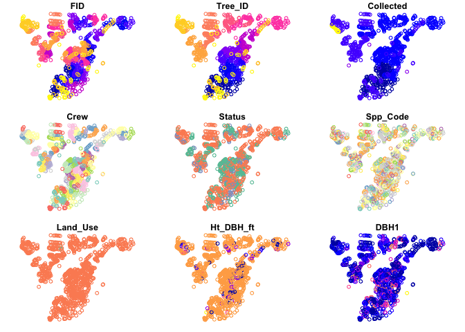
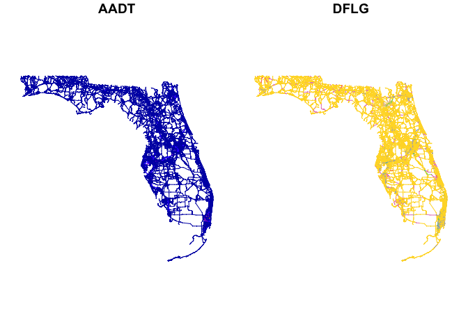
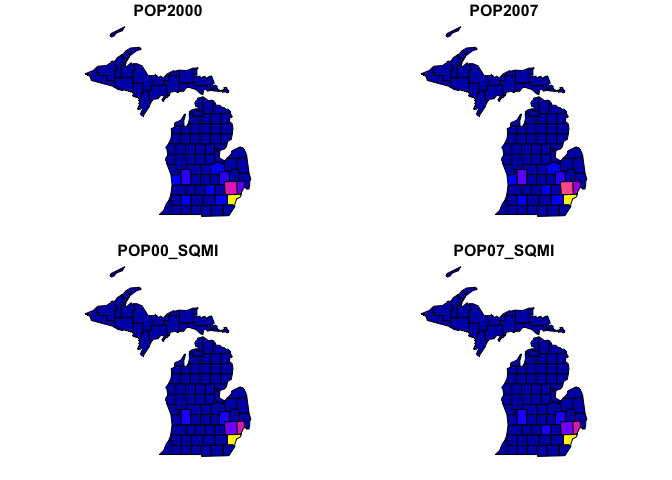

<!-- README.md is generated from README.Rmd. Please edit that file -->

# esri2sf

<!-- badges: start -->

[](https://CRAN.R-project.org/package=esri2sf)
[](https://www.repostatus.org/#active)
[](https://opensource.org/licenses/MIT)
<!-- badges: end -->

Scraping Geographic Features from ArcGIS Server

Still many geographic data is delivered through ESRI’s ArcGIS Server. It
is not easy to utilize the geographic data in the GIS servers from data
analysis platform like R or Pandas. This package enables users to scrape
vector data in ArcGIS Server from R through the server’s REST API. It
downloads geographic features from ArcGIS Server and converts the data
into as a [simple
feature](https://cran.r-project.org/web/packages/sf/vignettes/sf1.html)
object.

## How esri2sf works

This program sends a request to an ArcGIS Server and gets JSON responses
containing coordinates of geometries of which format is not the same as
GeoJSON. The JSON into simple feature geometries from the response. Then
it combines attribute data to the geometries to create sf dataframe.
Often ArcGIS servers limits the maximum number of rows in the result
set. So this program limits the number of features per request and
automatically re-send requests until it gets all features in the
dataset.

## Install

Use [pak](https://pak.r-lib.org/) to install this package. This package
imports cli, dplyr, httr (expect to drop this dependency), httr2 (new),
jsonlite, sf (\>= 1.0.1), and stats.

``` r
pak::pkg_install("yonghah/esri2sf")
```

## How to use esri2sf

What you need is the URL of REST service you want. You can get the URL
by viewing the URL widget on the service’s webpage (see image below), by
asking a GIS admin, or looking at the javascript code of a webpage where
it creates a feature layer.


### Point data

``` r
library(esri2sf)
url <- "https://services.arcgis.com/V6ZHFr6zdgNZuVG0/arcgis/rest/services/Landscape_Trees/FeatureServer/0"

df <- esri2sf(url, crs = NULL)
#> ✔ Downloading "Landscape_Trees" from
#>   <https://services.arcgis.com/V6ZHFr6zdgNZuVG0/arcgis/rest/services/Landscape_Trees/FeatureServer/0>
#> Layer type: "Feature Layer"
#> 
#> Geometry type: "esriGeometryPoint"
#> 
#> Service Coordinate Reference System: "EPSG:3857"
#> 
#> Output Coordinate Reference System: "EPSG:3857"
plot(df)
#> Warning: plotting the first 9 out of 56 attributes; use max.plot = 56 to plot
#> all
```


<!--  -->

### Polyline data

You can filter output fields. This may take a minute since it gets 18000
polylines.

``` r
url <- "https://services.arcgis.com/V6ZHFr6zdgNZuVG0/arcgis/rest/services/Florida_Annual_Average_Daily_Traffic/FeatureServer/0"
df <- esri2sf(url, outFields = c("AADT", "DFLG"), crs = NULL)
#> ✔ Downloading "Florida_Annual_Average_Daily_Traffic" from
#>   <https://services.arcgis.com/V6ZHFr6zdgNZuVG0/arcgis/rest/services/Florida_Annual_Average_Daily_Traffic/FeatureServer/0>
#> Layer type: "Feature Layer"
#> 
#> Geometry type: "esriGeometryPolyline"
#> 
#> Service Coordinate Reference System: "EPSG:3857"
#> 
#> Output Coordinate Reference System: "EPSG:3857"
plot(df)
```


<!--  -->

### Polygon data

You can filter rows as well by giving a `where` condition.

``` r
url <- "https://sampleserver1.arcgisonline.com/ArcGIS/rest/services/Demographics/ESRI_Census_USA/MapServer/3"
df <- esri2sf(
  url,
  where = "STATE_NAME = 'Michigan'",
  outFields = c("POP2000", "pop2007", "POP00_SQMI", "POP07_SQMI")
)
#> ✔ Downloading "Coarse Counties" from
#>   <https://sampleserver1.arcgisonline.com/ArcGIS/rest/services/Demographics/ESRI_Census_USA/MapServer/3>
#> Layer type: "Feature Layer"
#> 
#> Geometry type: "esriGeometryPolygon"
#> 
#> Service Coordinate Reference System: "EPSG:4269"
#> 
#> Output Coordinate Reference System: "EPSG:4269"
plot(df)
```



<!--  -->

### Tabular data

You can download non-spatial tables of the ‘Table’ layer type using
`esri2df()`.

``` r
df <- esri2df("https://sampleserver1.arcgisonline.com/ArcGIS/rest/services/WaterTemplate/WaterDistributionInventoryReport/MapServer/5", objectIds = paste(1:50, collapse = ","))
#> ✔ Downloading "AssetCondition"
#> Layer type: "Table"
df
#> # A tibble: 50 × 6
#>    OBJECTID FACILITYID FCLASS ASSETCOND CONDDATE REPLSCORE
#>       <int> <chr>      <chr>  <lgl>     <lgl>        <int>
#>  1        1 1          wMain  NA        NA               0
#>  2        2 2          wMain  NA        NA              45
#>  3        3 3          wMain  NA        NA              45
#>  4        4 4          wMain  NA        NA              45
#>  5        5 5          wMain  NA        NA              15
#>  6        6 6          wMain  NA        NA              15
#>  7        7 1          wMain  NA        NA               0
#>  8        8 2          wMain  NA        NA              45
#>  9        9 3          wMain  NA        NA              45
#> 10       10 4          wMain  NA        NA              45
#> # … with 40 more rows
```

### `crs` parameter example

When specifying the CRS parameter, any transformation that happens will
be done within ESRI’s REST API. Caution should be taken when specifying
an output `crs` that requires a datum transformation as ESRI will
automatically apply a default transformation (with no feedback as to
which one) which could end up adding small unexpected errors into your
data. By default, `esri2sf()` will transform any datasource to WGS 1984
(EPSG:4326), but it may be safer to set `crs = NULL` which will return
the data in the same CRS as it is being hosted as in the Feature/Map
Service. That way you can control any transformation manually in a
known, reproducible manner.

``` r
url <- "https://sampleserver1.arcgisonline.com/ArcGIS/rest/services/Demographics/ESRI_Census_USA/MapServer/3"
where <- "STATE_NAME = 'Michigan'"
outFields <- c("POP2000", "pop2007", "POP00_SQMI", "POP07_SQMI")

# default crs = 4326
esri2sf(url, where = where, outFields = outFields)
#> ✔ Downloading "Coarse Counties" from
#>   <https://sampleserver1.arcgisonline.com/ArcGIS/rest/services/Demographics/ESRI_Census_USA/MapServer/3>
#> Layer type: "Feature Layer"
#> 
#> Geometry type: "esriGeometryPolygon"
#> 
#> Service Coordinate Reference System: "EPSG:4269"
#> 
#> Output Coordinate Reference System: "EPSG:4269"
#> Simple feature collection with 83 features and 4 fields
#> Geometry type: MULTIPOLYGON
#> Dimension:     XY
#> Bounding box:  xmin: -90.4082 ymin: 41.69749 xmax: -82.41984 ymax: 48.1738
#> Geodetic CRS:  NAD83
#> First 10 features:
#>    POP2000 POP2007 POP00_SQMI POP07_SQMI                          geoms
#> 1     2301    2324        4.1        4.2 MULTIPOLYGON (((-88.49753 4...
#> 2    36016   36791       34.6       35.3 MULTIPOLYGON (((-88.50068 4...
#> 3     7818    7444        5.9        5.6 MULTIPOLYGON (((-88.98743 4...
#> 4     8746    8760        9.5        9.5 MULTIPOLYGON (((-88.67172 4...
#> 5    64634   64904       34.6       34.7 MULTIPOLYGON (((-87.6137 45...
#> 6    17370   17057       15.2       14.9 MULTIPOLYGON (((-88.9853 46...
#> 7     7024    7159        7.6        7.7 MULTIPOLYGON (((-85.85923 4...
#> 8     9862   10188       10.5       10.9 MULTIPOLYGON (((-87.11047 4...
#> 9     8903    8781        7.3        7.2 MULTIPOLYGON (((-86.45828 4...
#> 10   13138   12750       10.8       10.5 MULTIPOLYGON (((-88.9252 46...

# No transformation (recommended)
esri2sf(url, where = where, outFields = outFields, crs = NULL)
#> ✔ Downloading "Coarse Counties" from
#>   <https://sampleserver1.arcgisonline.com/ArcGIS/rest/services/Demographics/ESRI_Census_USA/MapServer/3>
#> Layer type: "Feature Layer"
#> 
#> Geometry type: "esriGeometryPolygon"
#> 
#> Service Coordinate Reference System: "EPSG:4269"
#> 
#> Output Coordinate Reference System: "EPSG:4269"
#> Simple feature collection with 83 features and 4 fields
#> Geometry type: MULTIPOLYGON
#> Dimension:     XY
#> Bounding box:  xmin: -90.4082 ymin: 41.69749 xmax: -82.41984 ymax: 48.1738
#> Geodetic CRS:  NAD83
#> First 10 features:
#>    POP2000 POP2007 POP00_SQMI POP07_SQMI                          geoms
#> 1     2301    2324        4.1        4.2 MULTIPOLYGON (((-88.49753 4...
#> 2    36016   36791       34.6       35.3 MULTIPOLYGON (((-88.50068 4...
#> 3     7818    7444        5.9        5.6 MULTIPOLYGON (((-88.98743 4...
#> 4     8746    8760        9.5        9.5 MULTIPOLYGON (((-88.67172 4...
#> 5    64634   64904       34.6       34.7 MULTIPOLYGON (((-87.6137 45...
#> 6    17370   17057       15.2       14.9 MULTIPOLYGON (((-88.9853 46...
#> 7     7024    7159        7.6        7.7 MULTIPOLYGON (((-85.85923 4...
#> 8     9862   10188       10.5       10.9 MULTIPOLYGON (((-87.11047 4...
#> 9     8903    8781        7.3        7.2 MULTIPOLYGON (((-86.45828 4...
#> 10   13138   12750       10.8       10.5 MULTIPOLYGON (((-88.9252 46...
```

Also since the addition of the `WKT1_ESRI` output from `sf::st_crs()` in
sf version 1.0-1, you can enter common CRS format (any that
`sf::st_crs()` can handle) into the `crs` parameters and it will be able
to convert to the ESRI formatted WKT needed for the outSR field in the
REST query. Below are examples of the variety of input types that you
can use with the `crs` parameters. All examples are just different
formulations of the ESRI:102690 CRS.

``` r
# ESRI Authority Code
df1 <- esri2sf(url, where = where, outFields = outFields, crs = "ESRI:102690")
#> ✔ Downloading "Coarse Counties" from
#>   <https://sampleserver1.arcgisonline.com/ArcGIS/rest/services/Demographics/ESRI_Census_USA/MapServer/3>
#> Layer type: "Feature Layer"
#> 
#> Geometry type: "esriGeometryPolygon"
#> 
#> Service Coordinate Reference System: "EPSG:4269"
#> 
#> Output Coordinate Reference System: "ESRI:102690"
# PROJ string
df2 <- esri2sf(url, where = where, outFields = outFields, crs = "+proj=lcc +lat_1=42.1 +lat_2=43.66666666666666 +lat_0=41.5 +lon_0=-84.36666666666666 +x_0=4000000 +y_0=0 +datum=NAD83 +units=us-ft +no_defs")
#> ✔ Downloading "Coarse Counties" from
#>   <https://sampleserver1.arcgisonline.com/ArcGIS/rest/services/Demographics/ESRI_Census_USA/MapServer/3>
#> Layer type: "Feature Layer"
#> 
#> Geometry type: "esriGeometryPolygon"
#> 
#> Service Coordinate Reference System: "EPSG:4269"
#> 
#> Output Coordinate Reference System: "+proj=lcc +lat_1=42.1
#> +lat_2=43.66666666666666 +lat_0=41.5 +lon_0=-84.36666666666666 +x_0=4000000
#> +y_0=0 +datum=NAD83 +units=us-ft +no_defs"
# OGC WKT
df3 <- esri2sf(url, where = where, outFields = outFields, crs = 'PROJCS["NAD_1983_StatePlane_Michigan_South_FIPS_2113_Feet",GEOGCS["GCS_North_American_1983",DATUM["North_American_Datum_1983",SPHEROID["GRS_1980",6378137,298.257222101]],PRIMEM["Greenwich",0],UNIT["Degree",0.017453292519943295]],PROJECTION["Lambert_Conformal_Conic_2SP"],PARAMETER["False_Easting",13123333.33333333],PARAMETER["False_Northing",0],PARAMETER["Central_Meridian",-84.36666666666666],PARAMETER["Standard_Parallel_1",42.1],PARAMETER["Standard_Parallel_2",43.66666666666666],PARAMETER["Latitude_Of_Origin",41.5],UNIT["Foot_US",0.30480060960121924],AUTHORITY["EPSG","102690"]]')
#> ✔ Downloading "Coarse Counties" from
#>   <https://sampleserver1.arcgisonline.com/ArcGIS/rest/services/Demographics/ESRI_Census_USA/MapServer/3>
#> Layer type: "Feature Layer"
#> 
#> Geometry type: "esriGeometryPolygon"
#> 
#> Service Coordinate Reference System: "EPSG:4269"
#> 
#> Output Coordinate Reference System:
#> "PROJCS[\"NAD_1983_StatePlane_Michigan_South_FIPS_2113_Feet\",GEOGCS[\"GCS_North_American_1983\",DATUM[\"North_American_Datum_1983\",SPHEROID[\"GRS_1980\",6378137,298.257222101]],PRIMEM[\"Greenwich\",0],UNIT[\"Degree\",0.017453292519943295]],PROJECTION[\"Lambert_Conformal_Conic_2SP\"],PARAMETER[\"False_Easting\",13123333.33333333],PARAMETER[\"False_Northing\",0],PARAMETER[\"Central_Meridian\",-84.36666666666666],PARAMETER[\"Standard_Parallel_1\",42.1],PARAMETER[\"Standard_Parallel_2\",43.66666666666666],PARAMETER[\"Latitude_Of_Origin\",41.5],UNIT[\"Foot_US\",0.30480060960121924],AUTHORITY[\"EPSG\",\"102690\"]]"
```

Their similarity on the output CRS can be proven by the following
function that calculates the mean difference in X-Y coordinates at each
point. All are very close to 0.

``` r
coord_diff <- function(df1, df2) {
  suppressWarnings({
    c(
      "x" = mean(sf::st_coordinates(sf::st_cast(df1, "POINT"))[, 1] - sf::st_coordinates(sf::st_cast(df2, "POINT"))[, 1]),
      "y" = mean(sf::st_coordinates(sf::st_cast(df1, "POINT"))[, 2] - sf::st_coordinates(sf::st_cast(df2, "POINT"))[, 2])
    )
  })
}
coord_diff(df1, df2)
#>             x             y 
#>  1.827251e-08 -1.191372e-09
coord_diff(df1, df3)
#>             x             y 
#>  1.827251e-08 -1.191372e-09
coord_diff(df2, df3)
#> x y 
#> 0 0
```
